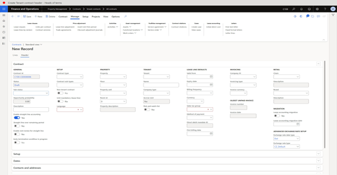
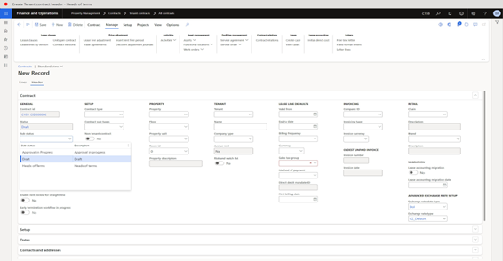
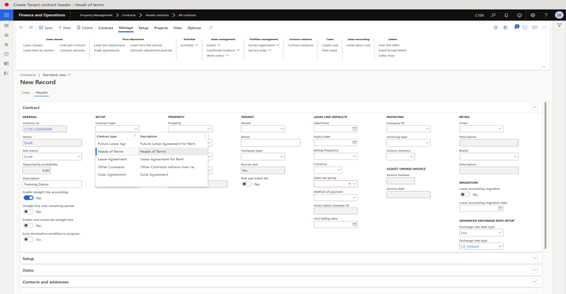
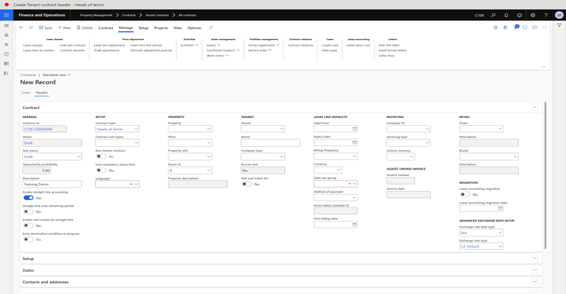
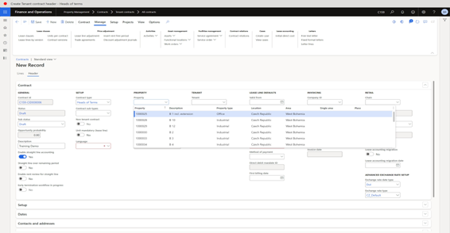
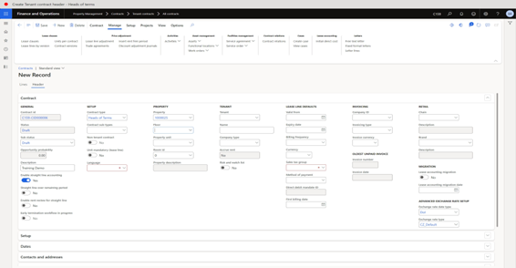
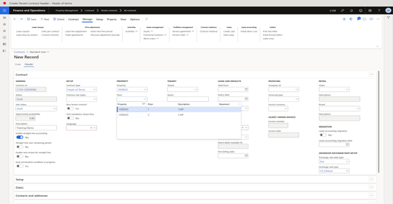
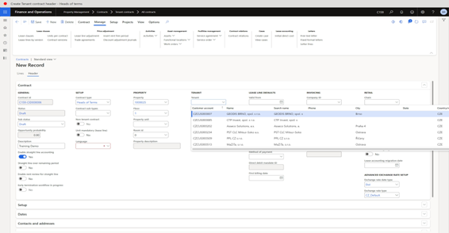
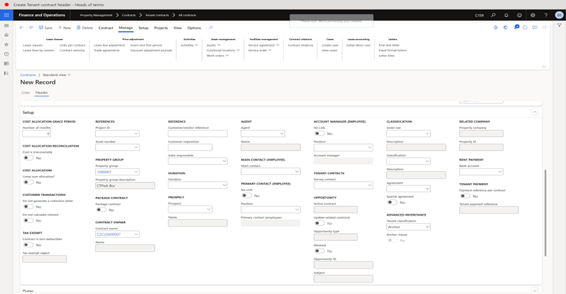

---
lab:
    title: 'Create Tenant contract header - Heads of terms'
---

# Objective

This lab consists of several exercises.

The first is basic **setup** in D365 of a new tenant contract header.

[ ] 1.	Go to **Property Management > Contracts > Tenant contracts > All contracts**.

4.	Click **New**.

5.	In the Sub status field, enter or select a value.

6.	In the list, select row 2.

 
8.	In the list, click the link in the selected row.

 
10.	In the **Description** field, type a value.
11.	In the **Contract** type field, enter or select a value.

 
13.	In the list, select row 2.

 
15.	In the list, click the link in the selected row.

 
17.	In the **Property** field, enter or select a value.

 
19.	In the list, click the link in the selected row.

 
21.	In the **Floor** field, enter or select a value.

 
23.	In the list, select row 2.

 
26.	In the **Tenant** field, enter or select a value.

 
28.	In the list, click the link in the selected row.

 
30.	In the **Valid** from field, enter a date.

32.	Expand the Setup section.
 
33.	Click **Save**.

 
